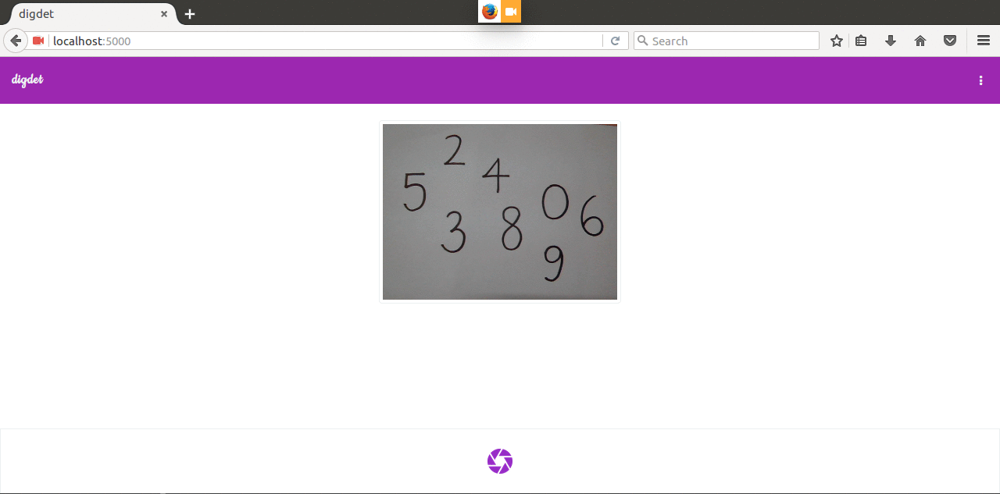

> A realtime digit OCR on the browser using Machine Learning

### Demo


You can view the demo on [https://digdet.herokuapp.com](https://digdet.herokuapp.com)

### Table of Contents
* [Installation](#installation)
* [Usage](#usage)
* [Dependencies](#dependencies)
* [License](#license)

### Installation
Download or clone the repository as follows:

```console
$ git clone git@github.com:achillesrasquinha/digdet.git
```

Install necessary dependencies:

```console
$ make install
```

### Usage

```console
$ make all
```

Your app should now be up and running on http://localhost:5000.

### Dependencies
* Python 2.7 and more or 3.5 and more
* Node.js
* SASS

### License
This repository has been released under the [MIT License](LICENSE).
